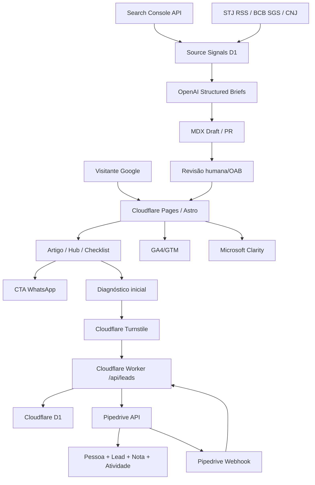

# Planejamento Final — blog.vradvogados Lead Engine

> **Para execução:** implementar em fases pequenas; cada fase só avança quando o lead real, tracking e performance forem verificados.

**Goal:** construir `blog.vradvogados.com.br` como motor orgânico de aquisição para a VR Advogados, usando o mínimo de investimento novo e reaproveitando OpenAI, Pipedrive e Cloudflare.

**Architecture:** Astro estático em Cloudflare Pages; APIs serverless em Cloudflare Workers; D1 como buffer/auditoria; Pipedrive como CRM fonte da verdade; OpenAI para operação editorial assistida, nunca autopublicação jurídica.

**Tech Stack:** Astro, TypeScript, MDX, Tailwind, Cloudflare Pages/Workers/D1/Turnstile, Pipedrive API, OpenAI Responses/Structured Outputs/Batch, GA4/GTM, Search Console API, Microsoft Clarity, Pagefind, Playwright, Lighthouse CI.

---

## 1. Produto

`blog.vradvogados.com.br` **não é blog institucional**.

É um funil editorial por intenção:

1. captura busca orgânica de alta intenção;
2. responde rápido a dor do visitante;
3. conduz para hub/artigo/checklist;
4. converte via WhatsApp ou diagnóstico;
5. cria lead qualificado no Pipedrive;
6. aprende com Search Console + Pipedrive + comercial.

Métrica principal:

```text
lead_rate = qualified_leads / eligible_sessions
```

Traffic vanity sem lead é só fogueira de vaidade.

---

## 2. Premissas confirmadas

- Já temos **Cloudflare**.
- Já temos **Pipedrive**.
- Já temos **OpenAI**.
- Objetivo é investir o mínimo possível.
- O domínio principal é `vradvogados.com.br`.
- O produto será publicado em `blog.vradvogados.com.br`.
- Segmento: direito bancário/consumidor/PJ, com compliance OAB.
- IA pode pilotar pesquisa/brief/draft, mas não publicar parecer jurídico automático.

---

## 3. Decisão de arquitetura

### Escolha final

```text
Astro + MDX + Cloudflare Pages
Cloudflare Workers + D1 + Turnstile
Pipedrive API para CRM
OpenAI API para editorial assistido
GA4/GTM + Search Console + Clarity para dados
```

### Por que essa stack

- **Menor custo:** evita Supabase, backend, automação paga e CMS pago.
- **SEO/performance:** Astro entrega HTML estático rápido.
- **Segurança:** sem WordPress/plugin hell.
- **Operação comercial:** Pipedrive já existe e vira fonte da verdade.
- **Automação controlada:** OpenAI gera pauta/brief/draft; humano revisa.
- **Escalabilidade suficiente:** Cloudflare Free cobre muito MVP; upgrade só se o canal provar valor.

### O que foi descartado

| Item | Decisão | Motivo |
| --- | --- | --- |
| WordPress frontend | Descartado | lento, pluginado, mais superfície de ataque |
| Supabase | Descartado no MVP | D1 cobre banco/buffer sem custo novo |
| Zapier/Make | Descartado | Worker integra direto, menos custo e menos ponto de falha |
| SERP API paga | Descartado | Search Console + fontes oficiais + pesquisa manual inicial bastam |
| WhatsApp API paga | Descartado no MVP | link `wa.me` valida conversão sem custo |
| Publicação automática | Proibida | risco OAB e risco de conteúdo ruim |

---

## 4. MVP funcional

### Escopo de lançamento

- Homepage orientada por dor.
- 5 hubs principais:
  - busca e apreensão;
  - juros abusivos/revisional;
  - dívidas PJ;
  - superendividamento;
  - cobranças/fraudes bancárias.
- 20 artigos iniciais.
- 3 checklists:
  - busca e apreensão;
  - juros abusivos;
  - dívida PJ.
- Diagnóstico inicial com formulário.
- Integração Pipedrive.
- GA4/GTM + Clarity + Search Console.
- Sitemap, robots, canonical, JSON-LD.
- Pipeline editorial assistido por IA.

### Conteúdo inicial

#### Busca e apreensão

```text
/busca-e-apreensao-veiculo/
/quantas-parcelas-atrasadas-busca-e-apreensao/
/oficial-de-justica-busca-e-apreensao-o-que-fazer/
/veiculo-de-trabalho-pode-ser-apreendido/
/como-recuperar-veiculo-apreendido/
/entrega-amigavel-quita-divida/
```

#### Juros abusivos

```text
/juros-abusivos-financiamento-veiculo/
/taxa-media-bacen-como-comparar/
/seguro-prestamista-e-obrigatorio/
/tarifas-bancarias-financiamento/
/acao-revisional-quando-vale-a-pena/
/parcelas-do-financiamento-nao-baixam/
```

#### Dívidas PJ

```text
/execucao-bancaria-empresa-o-que-fazer/
/capital-de-giro-juros-abusivos/
/bloqueio-judicial-conta-pj/
/avalista-divida-empresa-riscos/
/renegociacao-divida-pj-com-banco/
/ccb-bancaria-empresa-cuidados/
```

#### Superendividamento

```text
/lei-do-superendividamento-como-funciona/
/quais-dividas-entram-no-superendividamento/
/minimo-existencial-dividas/
/banco-e-obrigado-a-renegociar-divida/
```

#### Cobranças/fraudes

```text
/nome-negativado-indevidamente-o-que-fazer/
/cobranca-indevida-banco-como-resolver/
/emprestimo-nao-contratado/
/golpe-pix-responsabilidade-do-banco/
```

---

## 5. Arquitetura técnica



---

## 6. Modelos de dados

### Content Collections

#### `articles`

```ts
slug: string
title: string
seoTitle: string
metaDescription: string
cluster: 'busca-e-apreensao' | 'juros-abusivos' | 'dividas-pj' | 'superendividamento' | 'cobrancas-indevidas' | 'fraudes-bancarias'
intent: 'informational' | 'urgent' | 'commercial-investigation' | 'comparison' | 'checklist'
author: string
reviewedBy?: string
publishedAt: Date
updatedAt?: Date
heroImage?: string
imageAlt?: string
summary: string
primaryKeyword: string
secondaryKeywords: string[]
relatedArticles: string[]
ctaType: 'whatsapp' | 'diagnostic' | 'checklist' | 'form'
requiredDocuments: string[]
sources: { label: string; url: string }[]
oabRisk: 'low' | 'medium' | 'high'
noindex: boolean
canonical?: string
```

#### `hubs`

```ts
slug: string
title: string
seoTitle: string
metaDescription: string
cluster: string
summary: string
priorityArticles: string[]
faq: { question: string; answer: string }[]
ctaType: string
```

#### `glossary`

```ts
term: string
slug: string
definition: string
cluster: string
relatedArticles: string[]
```

### D1 tables

As tabelas completas ficam no `docs/SERVICE_API_MAP.md`, mas o mínimo é:

```text
leads
lead_events
pipedrive_outbox
source_signals
content_briefs
ai_runs
```

---

## 7. APIs próprias

### `POST /api/leads`

Entrada:

```json
{
  "name": "João Silva",
  "phone": "+5511999999999",
  "email": "joao@email.com",
  "person_type": "PF",
  "problem_type": "busca-e-apreensao",
  "bank_or_financial_institution": "Banco X",
  "has_lawsuit": false,
  "has_vehicle_seized": true,
  "contract_available": true,
  "approx_debt_value_range": "20k-50k",
  "message": "Recebi visita do oficial...",
  "lgpd_consent": true,
  "turnstile_token": "...",
  "utm_source": "google",
  "utm_medium": "organic",
  "utm_campaign": null,
  "landing_page": "/oficial-de-justica-busca-e-apreensao-o-que-fazer/",
  "referrer": "https://www.google.com/"
}
```

Resposta:

```json
{
  "ok": true,
  "request_id": "uuid",
  "message": "Recebemos seus dados. A equipe analisará as informações enviadas."
}
```

Critérios:
- valida Turnstile;
- valida LGPD;
- normaliza telefone;
- grava D1 antes de Pipedrive;
- cria/atualiza pessoa;
- cria lead;
- adiciona nota;
- se falhar Pipedrive, cria outbox;
- nunca retorna parecer jurídico.

### `POST /api/pipedrive/webhook`

Uso:
- receber `create/change/delete` de lead/deal/person;
- atualizar status local;
- registrar `qualify_lead`, `working_lead`, `close_convert_lead`, etc.

Critérios:
- validar segredo/shared auth;
- responder rápido;
- não confiar cegamente no payload: buscar detalhes se necessário;
- idempotência por event id/hash.

### `GET /api/health`

Retorna:

```json
{
  "ok": true,
  "version": "...",
  "d1": "ok",
  "timestamp": "..."
}
```

---

## 8. Tracking spec

### Eventos de navegação

```text
article_view
hub_view
scroll_50
scroll_75
scroll_90
cta_view
cta_click
whatsapp_click
form_start
form_submit
diagnostic_start
diagnostic_submit
checklist_open
checklist_complete
internal_link_click
search
select_content
```

### Eventos de lead recomendados GA4

```text
generate_lead
qualify_lead
disqualify_lead
working_lead
close_convert_lead
close_unconvert_lead
```

### Padrão `dataLayer`

```js
window.dataLayer.push({
  event: 'generate_lead',
  page_type: 'article',
  cluster: 'busca-e-apreensao',
  intent: 'urgent',
  lead_type: 'diagnostic',
  article_slug: 'oficial-de-justica-busca-e-apreensao-o-que-fazer',
  request_id: 'uuid'
})
```

---

## 9. Pipeline editorial AI-piloted

### Inputs semanais

1. Search Console queries.
2. Leads/objeções do Pipedrive/comercial.
3. Perguntas de WhatsApp/formulário.
4. STJ RSS.
5. BCB SGS.
6. CNJ DataJud quando fizer sentido.
7. Páginas com tráfego e baixa conversão.
8. Páginas com impressão e CTR baixo.

### Processo

```text
source_signals -> clusterização -> content_brief -> artigo MDX draft -> revisão OAB -> publish
```

### Regra de publicação

- IA pode sugerir.
- IA pode rascunhar.
- IA pode checar checklist.
- **IA não publica sozinha.**

### Priorização

```text
70% clusters comerciais fortes
20% long-tail SEO
10% notícias/oportunidades
```

---

## 10. Compliance OAB/editorial

### Permitido

- conteúdo informativo;
- explicação técnica;
- checklist;
- coleta de documentos/dados;
- CTA sóbrio;
- chatbot/formulário sem parecer jurídico automático.

### Proibido

- promessa de resultado;
- “limpe seu nome agora”;
- “recupere seu veículo garantido”;
- comparação com outros escritórios;
- autoengrandecimento;
- preço/honorário/desconto como isca;
- caso concreto patrocinado;
- urgência artificial agressiva.

### Disclaimer padrão

```text
Este conteúdo é informativo e não substitui a análise individual de um advogado. Cada caso depende dos documentos, valores, prazos e fase da cobrança ou processo.
```

---

## 11. Plano de execução

### Fase 0 — Setup e baseline

- Criar app Astro + TypeScript.
- Configurar Tailwind.
- Configurar Content Collections.
- Criar estrutura de rotas.
- Configurar Cloudflare Pages.
- Configurar headers/redirects.
- Configurar sitemap/robots.

Done quando:
- `npm run build` passa;
- deploy preview funciona;
- Lighthouse baseline roda.

### Fase 1 — Templates SEO/conversão

- Homepage por dor.
- Template de hub.
- Template de artigo.
- Template de checklist.
- Componentes JSON-LD.
- Componentes CTA.
- Disclaimer global.

Done quando:
- cada template renderiza com dados mock;
- JSON-LD é gerado;
- links internos funcionam;
- CTA aparece acima da dobra quando aplicável.

### Fase 2 — Lead capture mínimo

- Criar Worker `/api/leads`.
- Criar D1 schema.
- Configurar Turnstile.
- Criar formulário de diagnóstico.
- Validar payload server-side.
- Salvar lead em D1.
- Criar outbox.

Done quando:
- lead teste salva no D1;
- spam sem Turnstile é rejeitado;
- payload inválido retorna 400;
- nenhum segredo aparece no bundle frontend.

### Fase 3 — Pipedrive

- Implementar busca/criação de pessoa.
- Criar lead.
- Adicionar nota contextual.
- Criar atividade opcional.
- Persistir IDs no D1.
- Implementar retry outbox.
- Criar webhook inbound.

Done quando:
- lead real aparece no Pipedrive;
- nota contém UTM/página/dor/documentos;
- falha simulada reprocessa no Cron;
- webhook altera status local.

### Fase 4 — Tracking

- Instalar GTM/GA4.
- Implementar dataLayer.
- Marcar conversões.
- Instalar Clarity.
- Validar DebugView.
- Criar dashboard inicial.

Done quando:
- `generate_lead` aparece no GA4;
- `whatsapp_click` aparece;
- scroll/CTA aparecem;
- Clarity registra sessão.

### Fase 5 — Conteúdo MVP

- Criar 5 hubs.
- Criar 20 artigos.
- Criar 3 checklists.
- Criar glossário inicial.
- Revisar links internos.
- Revisar compliance OAB.

Done quando:
- todos os artigos têm fontes;
- todos têm CTA contextual;
- todos têm disclaimer;
- nenhuma promessa proibida passa.

### Fase 6 — AI editorial cockpit

- Criar tabela `source_signals`.
- Ingerir Search Console.
- Ingerir STJ RSS.
- Ingerir BCB SGS.
- Gerar briefs com OpenAI Structured Outputs.
- Salvar briefs em D1.
- Gerar draft MDX como PR/arquivo de revisão.

Done quando:
- brief JSON valida no schema;
- fontes ficam rastreáveis;
- draft não publica automaticamente;
- custo OpenAI é logado em `ai_runs`.

### Fase 7 — QA/Launch

- Playwright smoke tests.
- Lighthouse CI.
- Link checker.
- Rich Results Test.
- Search Console sitemap.
- Revisão final OAB.
- Deploy produção.

Done quando:
- Lighthouse Performance >= 90;
- SEO >= 95;
- formulário gera lead real;
- Pipedrive recebe lead;
- GA4 vê conversão;
- sitemap é aceito.

---

## 12. Roadmap 30/60/90

### 30 dias

- MVP publicado.
- 20 artigos indexáveis.
- Lead capture funcionando.
- Pipedrive funcionando.
- Tracking validado.
- Search Console ativo.

Meta:
```text
provar que páginas geram cliques, engajamento e primeiros leads rastreáveis
```

### 60 dias

- Ajustar titles/metas por Search Console.
- Expandir páginas posição 8–20.
- Criar 10–15 novos artigos baseados em dados.
- Revisar CTAs com Clarity.
- Começar qualificação de leads por cluster.

Meta:
```text
identificar clusters com maior lead_rate e melhor qualidade comercial
```

### 90 dias

- Dobrar clusters vencedores.
- Criar ferramentas/checklists extras.
- Fechar relatório de ROI orgânico.
- Decidir se vale pagar Cloudflare Workers ou CMS visual.

Meta:
```text
saber onde investir conteúdo e onde parar de gastar energia
```

---

## 13. Riscos e mitigação

| Risco | Impacto | Mitigação |
| --- | --- | --- |
| Conteúdo genérico | Não ranqueia/não converte | começar com dor real + resposta direta |
| OAB/compliance | Risco reputacional | checklist editorial obrigatório |
| Pipedrive fora do ar | Perda de lead | D1 primeiro + outbox retry |
| Spam | Lead lixo | Turnstile + rate limit + validação server-side |
| IA alucina | Conteúdo ruim | fontes obrigatórias + revisão humana |
| Tráfego sem lead | Vaidade | medir lead_rate por cluster |
| JS pesado | SEO/performance piora | Astro estático + ilhas mínimas |
| Custo OpenAI sobe | Margem piora | Batch, modelo barato, cache, limites por job |

---

## 14. Evidências usadas

- Cloudflare Pages limits: https://developers.cloudflare.com/pages/platform/limits/
- Cloudflare Workers pricing/free tier: https://developers.cloudflare.com/workers/platform/pricing/
- Cloudflare D1 pricing/free tier: https://developers.cloudflare.com/d1/platform/pricing/
- Cloudflare Turnstile validation: https://developers.cloudflare.com/turnstile/get-started/server-side-validation/
- Cloudflare Turnstile plans: https://developers.cloudflare.com/turnstile/plans/
- Cloudflare Cron Triggers: https://developers.cloudflare.com/workers/configuration/cron-triggers/
- Pipedrive Leads API: https://developers.pipedrive.com/docs/api/v1/Leads
- Pipedrive Persons API: https://developers.pipedrive.com/docs/api/v1/Persons
- Pipedrive Notes API: https://developers.pipedrive.com/docs/api/v1/Notes
- Pipedrive Activities API: https://developers.pipedrive.com/docs/api/v1/Activities
- Pipedrive Webhooks API: https://developers.pipedrive.com/docs/api/v1/Webhooks
- OpenAI Responses API: https://developers.openai.com/api/docs/guides/migrate-to-responses
- OpenAI Structured Outputs: https://developers.openai.com/api/docs/guides/structured-outputs
- OpenAI Batch API: https://developers.openai.com/api/docs/guides/batch
- GA4 recommended lead events: https://support.google.com/analytics/answer/9267735?hl=pt-BR
- Search Console Search Analytics API: https://developers.google.com/webmaster-tools/v1/searchanalytics/query
- Microsoft Clarity pricing: https://clarity.microsoft.com/pricing
- STJ RSS: https://www.stj.jus.br/sites/portalp/Comunicacao/conte%C3%BAdos-por-feed-(rss)
- BCB SGS Selic JSON: https://dadosabertos.bcb.gov.br/dataset/11-taxa-de-juros---selic/resource/b73edc07-bbac-430c-a2cb-b1639e605fa8
- BCB SGS PJ capital de giro: https://dadosabertos.bcb.gov.br/dataset/25443-taxa-media-mensal-de-juros-das-operacoes-de-credito-com-recursos-livres---pessoas-juridicas--/resource/e069b419-af84-4b51-9e9d-89b8308b1008
- CNJ DataJud API Pública: https://www.cnj.jus.br/sistemas/datajud/api-publica/
- Consumidor.gov API: https://consumidor.gov.br/pages/principal/documentacao-api

---

## 15. Decisão final

Construir enxuto, estático, mensurável e integrado ao Pipedrive.

A aposta correta não é “ter blog”. É montar uma máquina que responde dor real, captura intenção, cria lead rastreável e aprende quais clusters viram cliente.
