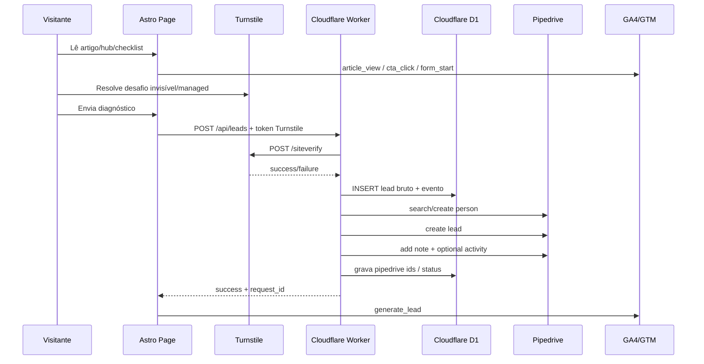

# Mapa de Serviços e APIs — blog.vradvogados

## Objetivo

Mapear tudo que o MVP usa para operar `blog.vradvogados.com.br` como motor orgânico de leads, com **mínimo investimento novo** e reaproveitando o que já existe: **OpenAI, Pipedrive e Cloudflare**.

## Decisão de custo

```text
Serviços novos pagos no MVP: nenhum.
Custo fixo novo esperado: R$0.
Custo variável esperado: consumo OpenAI + eventual upgrade Cloudflare Workers se ultrapassar free tier.
```

Nada de Supabase, Zapier, Make, WordPress frontend, SERP API paga, banco externo ou WhatsApp API paga no MVP. Isso seria comprar complexidade antes de provar lead.

---

## 1. Mapa executivo

| Camada | Serviço | Usamos para | Status/custo | Por quê |
| --- | --- | --- | --- | --- |
| DNS/CDN/deploy | Cloudflare Pages | Hospedar site estático | Já temos Cloudflare; Free viável | 500 builds/mês e 20k arquivos/site no Free |
| API/serverless | Cloudflare Workers | Leads, webhooks, cron, integrações | Free até 100k req/dia | Evita backend pago |
| Banco | Cloudflare D1 | Leads, outbox, sinais, logs IA | Free viável | 5M reads/dia, 100k writes/dia, 5GB |
| Anti-spam | Cloudflare Turnstile | Bloquear spam em forms | Free | 20 widgets + verificações ilimitadas |
| CRM | Pipedrive API | Criar pessoa/lead/nota/atividade | Já temos Pipedrive | CRM fonte da verdade |
| IA | OpenAI API | Briefs, rascunhos, revisão editorial | Já temos OpenAI | Structured outputs + Batch para reduzir custo |
| SEO data | Google Search Console API | Queries, impressões, CTR | Sem fornecedor pago | Dados reais do próprio domínio |
| Analytics | GA4/GTM | Funil e eventos | Sem fornecedor pago | GA4 tem eventos recomendados de lead |
| UX | Microsoft Clarity | Heatmaps/session replay | Free forever | Sem limite de tráfego declarado |
| Conteúdo externo | STJ RSS, BCB SGS, CNJ DataJud | Sinais oficiais | Público/free | Fonte confiável para pautas/dados |
| WhatsApp | Link `wa.me` com texto/UTM | Conversão rápida | Sem API paga | Evita custo e compliance extra no MVP |

---

## 2. Fluxo principal de lead



Regra de ouro: **D1 grava primeiro, Pipedrive sincroniza depois.** Se Pipedrive cair, o lead não some; entra no `pipedrive_outbox` e o Cron tenta de novo.

---

## 3. APIs por serviço

### 3.1 Cloudflare Pages

**Função:** hospedar o Astro estático.

Configuração:
```text
project: blog-vradvogados
production domain: blog.vradvogados.com.br
build command: npm run build
output directory: dist
```

Uso:
- deploy de produção;
- preview por branch;
- redirects;
- security headers;
- cache/CDN.

Evidência:
- Cloudflare Pages Free: 500 builds/mês, 100 custom domains por projeto, 20.000 arquivos por site.
- Docs: https://developers.cloudflare.com/pages/platform/limits/

---

### 3.2 Cloudflare Workers

**Função:** backend serverless barato.

Endpoints próprios:

```text
POST /api/leads
POST /api/checklist-submissions
POST /api/pipedrive/webhook
GET  /api/health
POST /api/admin/retry-outbox     # protegido, opcional
```

Handlers agendados:

```text
0 */6 * * *      retry Pipedrive outbox
10 7 * * 1      importar Search Console semanal
30 7 * * 1      gerar briefs semanais
0 8 * * *       ingerir RSS/fontes oficiais
```

Evidência:
- Workers Free: 100.000 requests/dia.
- Workers Paid: US$5/mês se precisar escalar.
- Cron Triggers executam Workers por expressão cron usando `scheduled()`.
- Docs: https://developers.cloudflare.com/workers/platform/pricing/
- Docs: https://developers.cloudflare.com/workers/configuration/cron-triggers/

---

### 3.3 Cloudflare D1

**Função:** banco local do produto, sem adicionar Supabase.

Tabelas mínimas:

```sql
create table leads (
  id text primary key,
  created_at text not null,
  updated_at text,
  name text not null,
  phone text not null,
  email text,
  person_type text,
  problem_type text not null,
  bank_or_financial_institution text,
  approx_debt_value_range text,
  has_lawsuit integer,
  has_vehicle_seized integer,
  contract_available integer,
  message text,
  landing_page text not null,
  source_article text,
  cluster text,
  utm_source text,
  utm_medium text,
  utm_campaign text,
  utm_content text,
  referrer text,
  user_agent text,
  ip_hash text,
  lgpd_consent integer not null,
  pipedrive_person_id integer,
  pipedrive_lead_id text,
  pipedrive_deal_id integer,
  pipedrive_status text,
  status text not null default 'new',
  qualified integer,
  disqualification_reason text
);

create index leads_created_at_idx on leads(created_at);
create index leads_phone_idx on leads(phone);
create index leads_pipedrive_lead_idx on leads(pipedrive_lead_id);

create table lead_events (
  id text primary key,
  lead_id text not null references leads(id),
  created_at text not null,
  event_name text not null,
  payload_json text
);

create table pipedrive_outbox (
  id text primary key,
  lead_id text references leads(id),
  created_at text not null,
  next_attempt_at text not null,
  attempts integer not null default 0,
  action text not null,
  payload_json text not null,
  last_error text,
  status text not null default 'pending'
);

create table source_signals (
  id text primary key,
  created_at text not null,
  source text not null,
  source_url text,
  title text,
  published_at text,
  cluster text,
  signal_type text,
  raw_json text,
  status text not null default 'new'
);

create table content_briefs (
  id text primary key,
  created_at text not null,
  updated_at text,
  cluster text not null,
  target_slug text,
  primary_keyword text,
  search_intent text,
  user_pain text,
  recommended_cta text,
  required_documents_json text,
  sources_json text,
  oab_risk text,
  status text not null default 'idea',
  brief_json text not null
);

create table ai_runs (
  id text primary key,
  created_at text not null,
  provider text not null default 'openai',
  model text,
  purpose text not null,
  input_hash text,
  output_ref text,
  tokens_input integer,
  tokens_output integer,
  estimated_cost_usd real,
  status text not null,
  error text
);
```

Evidência:
- D1 Free: 5M rows read/dia, 100k rows written/dia, 5GB storage.
- D1 cobra por query/storage e escala a zero; sem cobrança de egress.
- Docs: https://developers.cloudflare.com/d1/platform/pricing/

---

### 3.4 Cloudflare Turnstile

**Função:** anti-spam.

API:
```text
POST https://challenges.cloudflare.com/turnstile/v0/siteverify
```

Payload:
```json
{
  "secret": "$TURNSTILE_SECRET_KEY",
  "response": "token_do_cliente",
  "remoteip": "ip_opcional"
}
```

Regras:
- validar no Worker, nunca no frontend;
- token expira em 5 minutos;
- token é single-use;
- usar `idempotency_key` em retry;
- validar hostname/action quando configurado.

Evidência:
- Validação server-side obrigatória.
- Plano Free: até 20 widgets e verificações ilimitadas.
- Docs: https://developers.cloudflare.com/turnstile/get-started/server-side-validation/
- Docs: https://developers.cloudflare.com/turnstile/plans/

---

### 3.5 Pipedrive API

**Função:** CRM e operação comercial.

Base:
```text
PIPEDRIVE_API_BASE=https://{company}.pipedrive.com/api
# ou base oficial configurada na conta
```

Endpoints MVP:

| Ação | Endpoint | Quando usar |
| --- | --- | --- |
| Buscar pessoa | `GET /api/v2/persons/search` | Dedupe por telefone/e-mail |
| Criar pessoa | `POST /api/v2/persons` | Lead novo sem pessoa existente |
| Atualizar pessoa | `PATCH /api/v2/persons/{id}` | Enriquecer telefone/e-mail |
| Criar lead | `POST /api/v1/leads` | Entrada no Leads Inbox |
| Atualizar lead | `PATCH /api/v1/leads/{id}` | Status/labels/campos |
| Nota | `POST /api/v1/notes` | Contexto do formulário, UTM, página |
| Atividade | `POST /api/v2/activities` | Follow-up comercial |
| Webhook | `POST /api/v1/webhooks` | Mudanças de lead/person/deal |

Payload de lead recomendado:

```json
{
  "title": "Busca e apreensão — João Silva",
  "person_id": 123,
  "label_ids": [456],
  "visible_to": "3",
  "channel_id": "blog-vradvogados",
  "value": { "amount": 0, "currency": "BRL" }
}
```

Nota anexada:

```html
<strong>Origem:</strong> blog.vradvogados.com.br/oficial-de-justica-busca-e-apreensao-o-que-fazer/<br>
<strong>Dor:</strong> busca-e-apreensao<br>
<strong>UTM:</strong> google / organic / artigo<br>
<strong>Mensagem:</strong> ...<br>
<strong>Documentos:</strong> contrato disponível: sim; processo: não; veículo apreendido: sim
```

Evidência:
- Lead precisa de `title` e estar ligado a pessoa ou organização.
- Pipedrive Leads API: `POST /api/v1/leads`.
- Persons API: `POST /api/v2/persons`, `GET /api/v2/persons/search`.
- Notes API: notas são HTML e podem ser associadas a leads/pessoas/organizações.
- Activities API: atividades podem ser associadas a lead/person/org.
- Webhooks: `subscription_url` público, `event_action`, `event_object`; v2 default desde 2025-03-17.
- Docs: https://developers.pipedrive.com/docs/api/v1/Leads
- Docs: https://developers.pipedrive.com/docs/api/v1/Persons
- Docs: https://developers.pipedrive.com/docs/api/v1/Notes
- Docs: https://developers.pipedrive.com/docs/api/v1/Activities
- Docs: https://developers.pipedrive.com/docs/api/v1/Webhooks

---

### 3.6 OpenAI API

**Função:** cockpit editorial, não advogado robô.

Objetos gerados:

```text
content_signal_cluster
content_brief
article_outline
article_draft
seo_metadata
faq_block
internal_link_plan
oab_compliance_report
```

Padrões:
- usar Responses API;
- usar Structured Outputs com JSON Schema;
- usar Batch API para jobs não urgentes;
- cachear sinais e briefs;
- não enviar dados pessoais de lead para geração editorial;
- não publicar sem revisão humana.

Exemplo de schema de saída para brief:

```json
{
  "type": "object",
  "additionalProperties": false,
  "required": ["cluster", "target_slug", "search_intent", "short_answer", "sources", "oab_risk"],
  "properties": {
    "cluster": { "type": "string" },
    "target_slug": { "type": "string" },
    "primary_keyword": { "type": "string" },
    "search_intent": { "type": "string" },
    "user_pain": { "type": "string" },
    "short_answer": { "type": "string" },
    "outline": { "type": "array", "items": { "type": "string" } },
    "recommended_cta": { "type": "string" },
    "required_documents": { "type": "array", "items": { "type": "string" } },
    "sources": { "type": "array", "items": { "type": "string" } },
    "oab_risk": { "type": "string", "enum": ["low", "medium", "high"] }
  }
}
```

Evidência:
- Responses API é a direção recomendada para novos fluxos.
- Structured Outputs usa `text.format`/schema para saída validável.
- Batch API dá 50% de desconto, rate limits separados e conclusão em até 24h.
- Docs: https://developers.openai.com/api/docs/guides/migrate-to-responses
- Docs: https://developers.openai.com/api/docs/guides/structured-outputs
- Docs: https://developers.openai.com/api/docs/guides/batch

---

### 3.7 Google Search Console API

**Função:** alimentar pauta com demanda real.

Endpoint:
```text
POST https://www.googleapis.com/webmasters/v3/sites/{siteUrl}/searchAnalytics/query
```

Request semanal:
```json
{
  "startDate": "YYYY-MM-DD",
  "endDate": "YYYY-MM-DD",
  "dimensions": ["query", "page", "device"],
  "rowLimit": 25000
}
```

Saída usada:
- query;
- page;
- clicks;
- impressions;
- ctr;
- position.

Uso no produto:
- páginas com impressão alta e CTR baixo → reescrever title/meta;
- queries com posição 8–20 → expandir conteúdo/link interno;
- queries novas por dor → briefs;
- páginas com clique e sem lead → CTA/formulário.

Evidência:
- Search Console API permite consultar tráfego com filtros, dimensões e data range; requer autorização.
- Docs: https://developers.google.com/webmaster-tools/v1/searchanalytics/query

---

### 3.8 GA4/GTM

**Função:** medir funil.

Eventos recomendados GA4 para lead:
```text
generate_lead
qualify_lead
disqualify_lead
working_lead
close_convert_lead
close_unconvert_lead
```

Eventos próprios de navegação:
```text
article_view
hub_view
scroll_50
scroll_75
scroll_90
cta_view
cta_click
whatsapp_click
form_start
form_submit
diagnostic_start
diagnostic_submit
checklist_open
checklist_complete
internal_link_click
search
select_content
```

`dataLayer` padrão:

```js
window.dataLayer.push({
  event: 'cta_click',
  page_type: 'article',
  cluster: 'busca-e-apreensao',
  intent: 'urgent',
  cta_type: 'whatsapp',
  cta_position: 'inline_after_documents',
  article_slug: 'oficial-de-justica-busca-e-apreensao-o-que-fazer'
})
```

Evidência:
- GA4 recomenda eventos de lead generation e define quando disparar `generate_lead`.
- Docs: https://support.google.com/analytics/answer/9267735?hl=pt-BR

---

### 3.9 Microsoft Clarity

**Função:** enxergar comportamento real sem ferramenta paga.

Uso:
- identificar rage/dead clicks;
- ver se usuário ignora CTA;
- testar formulário/checklist;
- priorizar melhoria de UX.

Evidência:
- Clarity informa ser grátis, sem limites de tráfego e com heatmaps/session recordings.
- Fonte: https://clarity.microsoft.com/pricing

---

### 3.10 Fontes oficiais externas

#### STJ RSS

Feeds:
```text
Notícias: https://res.stj.jus.br/hrestp-c-portalp/RSS.xml
Pesquisa Pronta: https://scon.stj.jus.br/SCON/PesquisaProntaFeed
Jurisprudência em Teses: https://scon.stj.jus.br/SCON/JurisprudenciaEmTesesFeed
Informativo: https://processo.stj.jus.br/jurisprudencia/externo/InformativoFeed
```

Uso:
- sinais de pauta;
- atualização de artigos;
- fonte oficial para links/citações.

Fonte: https://www.stj.jus.br/sites/portalp/Comunicacao/conte%C3%BAdos-por-feed-(rss)

#### BCB SGS JSON

Padrão:
```text
https://api.bcb.gov.br/dados/serie/bcdata.sgs.{codigo}/dados?formato=json&dataInicial=dd/MM/aaaa&dataFinal=dd/MM/aaaa
https://api.bcb.gov.br/dados/serie/bcdata.sgs.{codigo}/dados/ultimos/{N}?formato=json
```

Séries iniciais:
```text
11     Selic
25443  Taxa média PJ capital de giro rotativo
```

Uso:
- artigos sobre taxa média;
- dados oficiais para revisional/juros;
- tabelas e gráficos simples.

Fontes:
- https://dadosabertos.bcb.gov.br/dataset/11-taxa-de-juros---selic/resource/b73edc07-bbac-430c-a2cb-b1639e605fa8
- https://dadosabertos.bcb.gov.br/dataset/25443-taxa-media-mensal-de-juros-das-operacoes-de-credito-com-recursos-livres---pessoas-juridicas--/resource/e069b419-af84-4b51-9e9d-89b8308b1008

#### CNJ DataJud API Pública

Uso:
- metadados públicos do Judiciário;
- pesquisa e contexto macro;
- não usar para prometer resultado.

Fonte: https://www.cnj.jus.br/sistemas/datajud/api-publica/

#### Consumidor.gov

Uso possível:
- somente se houver credenciais/habilitação;
- não é caminho crítico.

Limitação:
- API exige credenciais, token temporário e tem janelas de disponibilidade/livre acesso.

Fonte: https://consumidor.gov.br/pages/principal/documentacao-api

---

## 4. APIs excluídas do MVP

| Serviço | Decisão | Motivo |
| --- | --- | --- |
| Supabase | Não usar | D1 resolve leads/outbox/sinais sem custo novo |
| Resend/Sendgrid | Não usar | Pipedrive recebe lead; e-mail é fallback posterior |
| Zapier/Make | Não usar | Worker integra direto com Pipedrive/OpenAI |
| WordPress frontend | Não usar | Performance, segurança e plugins viram dívida |
| SERP API paga | Não usar | Search Console + conteúdo oficial + SERP manual inicial |
| WhatsApp Business API | Não usar no MVP | Link `wa.me` basta para validar conversão |
| Serasa/Experian | Não usar | Custo/compliance alto; não necessário para gerar lead |
| Banco pago externo | Não usar | D1 é suficiente no MVP |

---

## 5. Ordem de implementação

1. **Fundação:** Astro + Cloudflare Pages + rotas/hubs.
2. **Lead capture:** Worker `/api/leads` + Turnstile + D1.
3. **CRM:** Pipedrive person/lead/note/activity + outbox retry.
4. **Tracking:** GTM/GA4 + eventos + Clarity.
5. **Conteúdo MVP:** hubs + 20 artigos + checklists + diagnóstico.
6. **IA assistida:** Search Console/RSS/BCB → briefs OpenAI → PR/revisão humana.
7. **Webhooks:** status Pipedrive → D1 → eventos de qualificação/fechamento.

---

## 6. Definition of Done das integrações

- [ ] `POST /api/leads` rejeita spam sem Turnstile válido.
- [ ] Lead fica salvo no D1 antes de qualquer chamada externa.
- [ ] Lead cria/atualiza pessoa no Pipedrive.
- [ ] Lead aparece no Leads Inbox com label e nota contextual.
- [ ] Falha do Pipedrive cria item em `pipedrive_outbox`.
- [ ] Cron reprocessa outbox com backoff.
- [ ] `generate_lead` aparece no GA4 DebugView.
- [ ] Clarity carrega sem degradar Core Web Vitals.
- [ ] Search Console import gera `source_signals`.
- [ ] OpenAI gera `content_brief` validado por JSON schema.
- [ ] Nenhum artigo é publicado automaticamente sem revisão humana/OAB.
